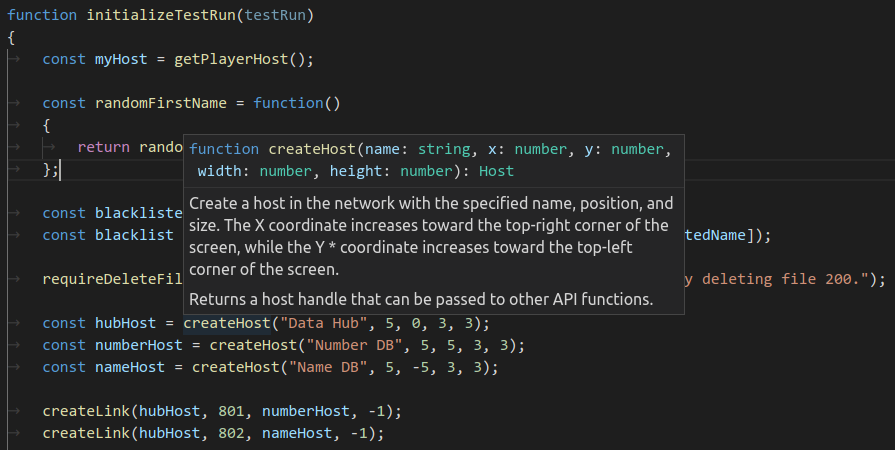

# EXATYPES

JavaScript type information for the [EXAPUNKS](http://www.zachtronics.com/exapunks/) custom level code which aids in writing code by supplying documentation, auto-completion and type safety.



## Usage Suggestions

The type declaration file works well with [Visual Studio Code](https://code.visualstudio.com/) and strict TypeScript settings are recommended to catch the accidental use of undefined symbols and various other issues.

To turn on the type checking of your level code, add the comment `// @ts-check` at the top of your file.

Example `tsconfig.json` to turn on strict mode:

```json
{
    "compilerOptions": {
        "strict": true,
        "lib": ["es5"],
    },
}
```